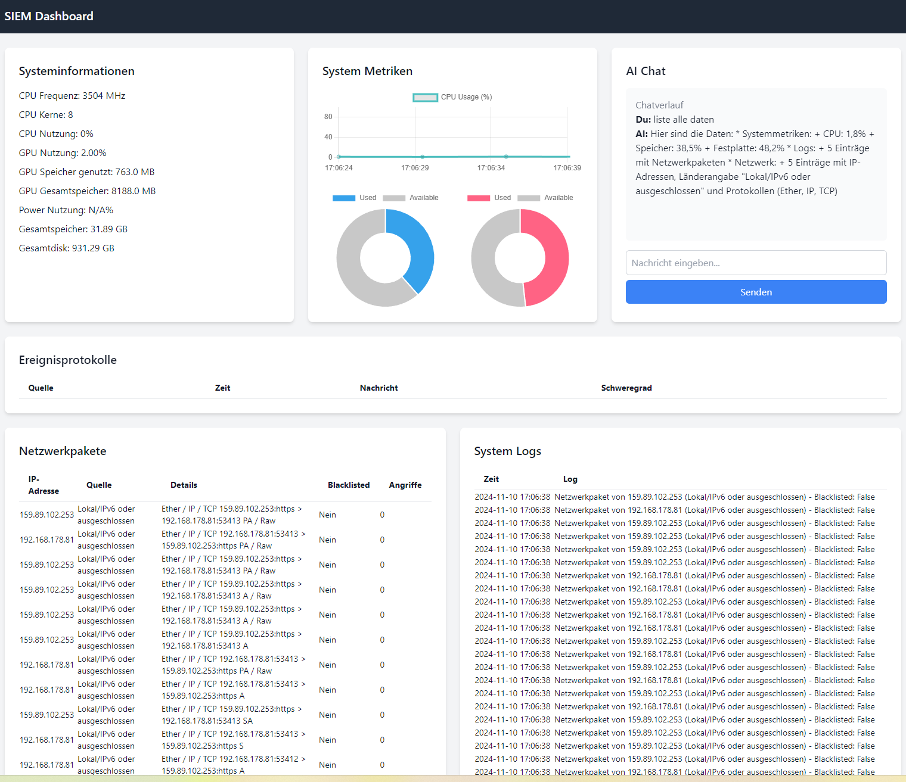

# SecOps-AI: Real-Time AI-Driven SIEM Threat Operator

SecOps-AI is an advanced, high-performance Security Information and Event Management (SIEM) real-time threat detection and acceleration pipeline. Built to address modern Security Operations Center (SOC) bottlenecks and drastically reduce alert fatigue, the platform ingests high-volume Syslog and Windows event logs, applies dual-engine deep learning models, and leverages ultra-low-latency LLM inference to deliver instant, actionable threat triage.

---

## 🚀 System Architecture & Core Capabilities

The architecture is split into a high-concurrency data ingestion engine, an embedded deep learning classification layer, and an accelerated AI orchestration tier:

* **Dual-Engine Threat Analysis (CNN + NLP):** Features an integrated Convolutional Neural Network (CNN) engineered for spatial pattern and anomaly recognition within network packet structures, combined with Natural Language Processing (NLP) primitives to tokenize and classify incoming event text streams.
* **Asynchronous Ingestion Engine:** Designed around an agile, event-driven web framework (Flask-SocketIO/FastAPI architecture) optimized for real-time, bi-directional telemetry streaming, live log parsing, and concurrent system metric tracking (CPU, RAM, GPU states).
* **Groq API Telemetry Acceleration:** Integrated directly with the Groq API to run lightning-fast hardware-accelerated LLM inference. It instantly transforms raw, cryptic, or high-volume log payloads into concise, structured, human-readable contextual threat summaries.
* **Automated Triage Dashboard:** Features a responsive, frontend console built with Tailwind CSS and Chart.js, visualizing streaming network metrics while maintaining an automated, rule-based triage and incident chat environment for rapid operator decision-making.

---

## 🛠️ Tech Stack & Infrastructure

* **Backend Engine:** Python 3.10+ | Flask / FastAPI Core Architecture
* **AI/ML Layer:** PyTorch / TensorFlow (CNN Packet IDS & NLP Sequence Classification)
* **Inference Pipeline:** Groq API & Ollama Core Execution Edge (Llama 3.2 Deployment)
* **Real-Time Data Layer:** WebSockets (Socket.IO) & Asynchronous Event Loops
* **Storage Matrix:** Structured SQLite Database Engine for persistent audit logging and forensic traceability
* **UI/UX Layer:** Tailwind CSS, HTML5, Chart.js (Real-time Canvas Rendering)

## Installation

1. **Clone the repository**:
   ```bash
   git clone https://github.com/Keyvanhardani/AI-Driven-SIEM-Realtime-Operator-with-Groq-Integration.git
   cd AI-Driven-SIEM-Operator
   ```

2. **Install dependencies**:
   ```bash
   pip install -r requirements.txt
   Install Ollama and Llama3.2
   ```

3. **Configure Groq API**:
   - Add your Groq API key to `config.py`:
   ```python
   GROQ_API_KEY = "your_groq_api_key"
   ```

4. **Run the application**:
   ```bash
   python app.py
   ```

## Usage

- **Access the dashboard**: Navigate to `http://localhost:5000` to view system metrics, logs, and network data.
- **Real-time monitoring**: Receive live metrics, network activity, and AI-generated alerts in real-time.
- **Customizable API**: Integrate with Groq to leverage high-performance AI analysis.

## License
This project is licensed under the MIT License. See the [LICENSE](LICENSE) file for more information.
```
