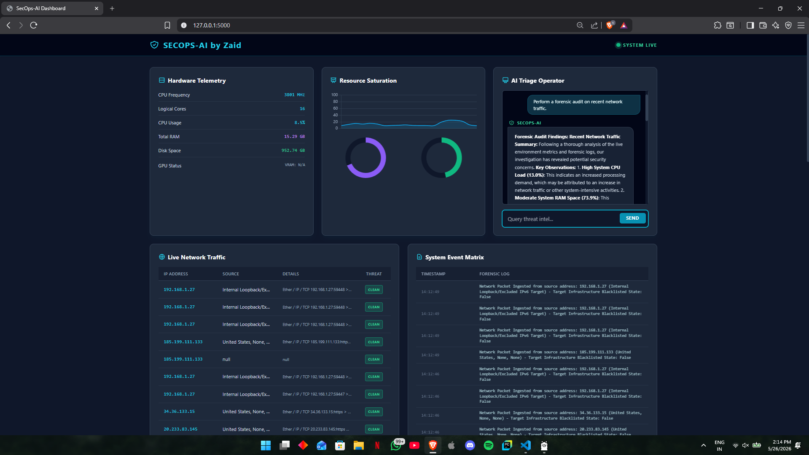

# SecOps-AI: Real-Time AI-Driven SIEM Threat Operator

SecOps-AI is an advanced, high-performance Security Information and Event Management (SIEM) real-time threat detection and acceleration pipeline. Built to address modern Security Operations Center (SOC) bottlenecks and drastically reduce alert fatigue, the platform ingests high-volume Syslog and Windows event logs, applies dual-engine deep learning models, and leverages ultra-low-latency LLM inference to deliver instant, actionable threat triage.

---

## 🚀 System Architecture & Core Capabilities

The architecture is split into a high-concurrency data ingestion engine, an embedded deep learning classification layer, and an accelerated AI orchestration tier:

* **Dual-Engine Threat Analysis (CNN + NLP):** Features an integrated Convolutional Neural Network (CNN) engineered for spatial pattern and anomaly recognition within network packet structures, combined with Natural Language Processing (NLP) primitives to tokenize and classify incoming event text streams.
* **Asynchronous Ingestion Engine:** Designed around an agile, event-driven web framework (Flask-SocketIO/FastAPI architecture) optimized for real-time, bi-directional telemetry streaming, live log parsing, and concurrent system metric tracking (CPU, RAM, GPU states).
* **Groq API Telemetry Acceleration:** Integrated directly with the Groq API to run lightning-fast hardware-accelerated LLM inference. It instantly transforms raw, cryptic, or high-volume log payloads into concise, structured, human-readable contextual threat summaries.
* **Automated Triage Dashboard:** Features a responsive, frontend console built with Tailwind CSS and Chart.js, visualizing streaming network metrics while maintaining an automated, rule-based triage and incident chat environment for rapid operator decision-making.

---

## 🛠️ Tech Stack & Infrastructure

* **Backend Engine:** Python 3.10+ | Flask / FastAPI Core Architecture
* **AI/ML Layer:** PyTorch / TensorFlow (CNN Packet IDS & NLP Sequence Classification)
* **Inference Pipeline:** Groq API & Ollama Core Execution Edge (Llama 3.2 Deployment)
* **Real-Time Data Layer:** WebSockets (Socket.IO) & Asynchronous Event Loops
* **Storage Matrix:** Structured SQLite Database Engine for persistent audit logging and forensic traceability
* **UI/UX Layer:** Tailwind CSS, HTML5, Chart.js (Real-time Canvas Rendering)

## Installation

1. **Clone the repository**:
   ```bash
   git clone https://github.com/your-username/SecOps-AI.git
   cd SecOps-AI
   ```

2. **Set up a virtual environment (Recommended)**:
   
   It is best practice to run the application in a virtual environment to avoid dependency conflicts.

   ```bash
   # Create the virtual environment
   python -m venv venv

   # Activate it (Windows PowerShell)
   .\venv\Scripts\Activate.ps1
   ```

3. **Install dependencies**:
   
   Install all required libraries, including TensorFlow, Scapy, and SocketIO.

   ```bash
   pip install -r requirements.txt
   ```

4. **Configure environment variables**:
   
   Create a file named `.env` in the root directory. This file will securely store your credentials.

   ```env
   GROQ_API_KEY=your_groq_api_key_here
   HF_TOKEN=your_huggingface_token_here
   ```

   - **GROQ_API_KEY**: Get your API key from `console.groq.com`
   - **HF_TOKEN**: Get your read-access token from `huggingface.co/settings/tokens` to automatically download the `SecIDS-CNN` model.

5. **Install & run local AI dependencies**:
   
   The system leverages local LLM inference for edge alert generation.

   **Install Ollama**: Download and install Ollama from `ollama.com`

   **Pull Llama 3.2 model**:
   ```bash
   ollama pull llama3.2
   ```

   Ensure Ollama is running in the background before starting the application.

6. **Run the application**:
   
   Start the SecOps-AI pipeline.

   > **Note:** Packet sniffing requires **Administrator privileges**.

   ```bash
   # Run in Administrator PowerShell
   python app_groq.py
   ```

7. **Access the dashboard**:
   
   Once the server is running, open your browser and navigate to:

   ```text
   http://127.0.0.1:5000
   ```

## Pro Tips for Deployment

- **Npcap (Windows)**: Ensure Npcap is installed for the Scapy packet sniffer to capture live network traffic.

- **GPU Support**: TensorFlow defaults to CPU-only on Windows. For production-grade inference, consider running the project inside **WSL2 (Windows Subsystem for Linux)** to leverage CUDA/GPU acceleration.

## Usage

- **Access the dashboard**: Navigate to `http://localhost:5000` to view system metrics, logs, and network data.
- **Real-time monitoring**: Receive live metrics, network activity, and AI-generated alerts in real-time.
- **Customizable API**: Integrate with Groq to leverage high-performance AI analysis.

## License
This project is licensed under the MIT License. See the [LICENSE](LICENSE) file for more information.
```
