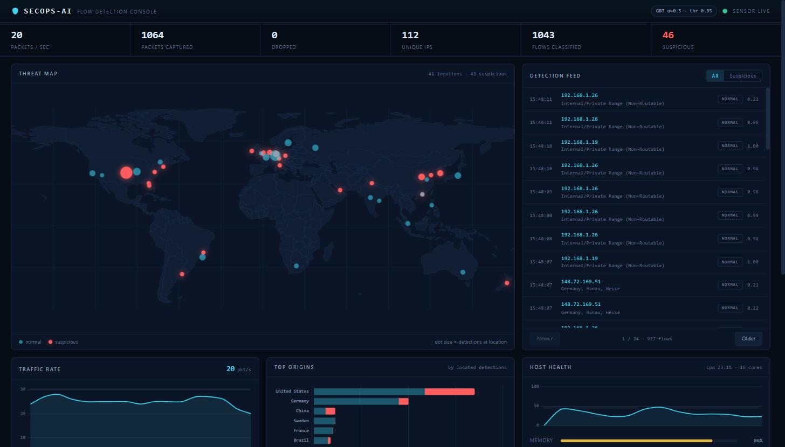
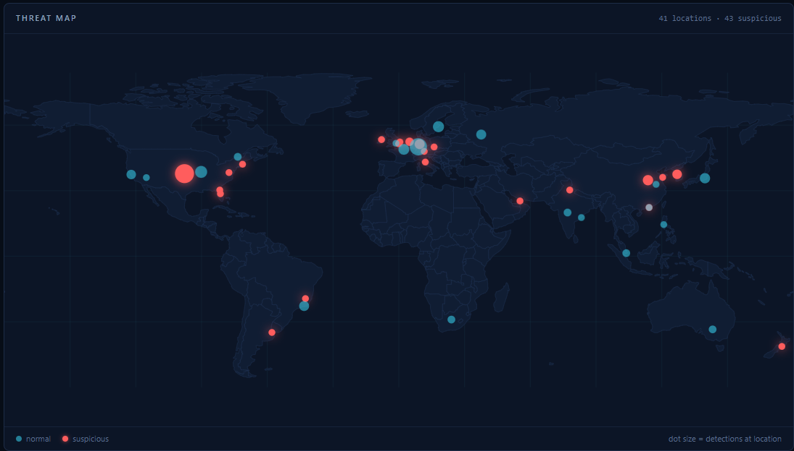

*The console during a demo replay plus live capture: flow verdicts from the shipped GBT, detection origins on the map, and pipeline counters — all real data.*

# SecOps-AI: Real-Time AI-Driven SIEM Threat Operator

SecOps-AI is an advanced, high-performance Security Information and Event Management (SIEM) real-time threat detection and acceleration pipeline. Built to address modern Security Operations Center (SOC) bottlenecks and drastically reduce alert fatigue, the platform ingests high-volume Syslog and Windows event logs, applies dual-engine deep learning models, and leverages ultra-low-latency LLM inference to deliver instant, actionable threat triage.

---

## 🚀 System Architecture & Core Capabilities

The architecture is split into a high-concurrency data ingestion engine, an embedded deep learning classification layer, and an accelerated AI orchestration tier:

* **Flow-based ML threat detection:** Sniffed packets are aggregated into bidirectional flows (`flow_tracker.py`) and scored by a classifier we trained ourselves on CIC-IDS-2017 flow features (`cnn_engine.py`). See **Threat Detection Engine** below for the model, its held-out metrics, and why the borrowed `SecIDS-CNN.h5` is not used for inference.
* **Asynchronous Ingestion Engine:** Designed around an agile, event-driven web framework (Flask-SocketIO/FastAPI architecture) optimized for real-time, bi-directional telemetry streaming, live log parsing, and concurrent system metric tracking (CPU, RAM, GPU states).
* **Groq API Telemetry Acceleration:** Integrated directly with the Groq API to run lightning-fast hardware-accelerated LLM inference. It instantly transforms raw, cryptic, or high-volume log payloads into concise, structured, human-readable contextual threat summaries.
* **SOC Console:** A self-contained operator dashboard (hand-written CSS, vendored Chart.js/Socket.IO, bundled world GeoJSON — no CDN, no tile server, renders offline): live threat map, verdict-badged detection feed, pipeline counters, and an LLM triage chat. See **SOC Console** below.

---

## 🧠 Threat Detection Engine

Packets alone can't be classified by a flow-trained model, so the pipeline is:

```
capture → flow aggregation (flow_tracker.py) → feature extraction → classifier (cnn_engine.py) → verdict → DB + dashboard
```

**Why we don't use the borrowed `SecIDS-CNN.h5`.** The project originally shipped
`Keyven/SecIDS-CNN`, but its input is a 10-feature vector whose **feature names,
order, and scaler were never published** (the upstream `preprocess_data()` is an
empty placeholder). Feeding our own flow features into it would produce
confident-looking but meaningless verdicts. Rather than fake it, we **trained our
own model** on the exact flow features our tracker emits. `SecIDS-CNN.h5` was
removed from the inference path entirely and is **not shipped** with this repo;
the detector loaded at runtime is our own, trained in-repo and stored in `models/`.

**Our model.** Trained on **CIC-IDS-2017** (CICFlowMeter flow features). Two
models are produced by `train_flow_model.py`:

* **Gradient-boosted trees (primary, shipped for inference).** On low-dimensional
  tabular flow features, trees beat the CNN — as expected.
* **Compact Conv1D (documented baseline).** Kept for comparison, not used live.

**The operating point is chosen from data, not intuition.** Training sweeps a
frontier of class-weighting strength (`w ∝ 1/n^α`, α ∈ {0…0.5}) × decision
threshold (0.5…0.95) and picks the point that **maximises macro attack recall
subject to a hard budget of per-flow benign FPR ≤ 1%**, selected on a validation
split and reported on a held-out test split the selection never saw. The chosen
point is **α = 0.5, threshold = 0.95** (`config.CLASSIFY_THRESHOLD`); the full
frontier table is in `models/metrics.json`.

**False positives are counted per FLOW, not per shape.** The dedup evaluation
scores each unique feature vector once, but one common benign shape stands for
thousands of real flows — a model that misfires on a few common shapes looks
fine per-shape and is unusable per-flow (we measured a 12× gap on an earlier
fully class-balanced fit). Every benign FPR quoted here weights each shape by
its real multiplicity in the dataset.

**The benchmark is like-for-like: each model at its own tuned operating point.**
Both models are swept over the same α × threshold grid under the same FPR
budget, and each is reported at its own best point — scoring the baseline at
the primary's threshold would rig the comparison. On the CIC-IDS-2017
held-out test split:

| Model | Own operating point | Per-flow benign FPR (CIC-IDS-2017 held-out test) | Macro recall | Weighted recall | F1 |
|---|---|---|---|---|---|
| **GBT (shipped)** | α=0.5, thr=0.95 | **0.15%** (budget ≤ 1%) | **0.72** | 0.97 | **0.985** |
| Conv1D (baseline) | α=0.15, thr=0.65 | 0.98% | 0.29 | 0.60 | 0.727 |

Every number above is measured on CIC-IDS-2017, not on a live network. Live
benign traffic is a different distribution and runs hotter — in LAN capture we
observe benign flows scoring closer to the threshold than the dataset's benign
does — so no live-network FPR is claimed here; the budget governs the dataset
evaluation that selected the operating point.

| Split | Meaning | GBT F1 | Conv1D F1 |
|---|---|---|---|
| **Dedup + stratified, held-out test** | **Headline** — identical flows can't span splits | **0.985** | 0.727 |
| Random stratified | Optimistic upper bound (duplicate bursts leak) | 0.940 | 0.421 |
| Group by source IP | Degenerate — one IP emits 99.6% of attacks | 0.001 | 0.000 |

The shipped GBT is exactly the model the frontier measured (trained on the 60%
train split), so the selection evidence describes the deployed artifact. Even
at its own best operating point the Conv1D reaches less than half the GBT's
macro recall while spending nearly the whole FPR budget — which is why the GBT
ships. A per-feature leakage check found no single feature exceeding 0.72 AUC.
Full numbers, per-class recall, and both frontiers: `models/metrics.json`.

**Retrain / reproduce:**
```bash
python train_flow_model.py --parquet path/to/CICIDS_Flow.parquet
```

**PCAP replay (live/replay share one code path).** You can run a capture file
through the exact same flow-detection path as live sniffing:
```bash
python app_groq.py --replay samples/heartbleed-excerpt.pcap
```
`replay_pcap()` reuses `_ingest_packet_flows` + `_handle_completed_flow`, so
replayed verdicts are persisted and emitted identically to live traffic.

`samples/dos-volumetric.pcap` is the in-scope proof capture: real CIC-IDS-2017
volumetric-attack flow shapes (DDoS, the four DoS variants, PortScan)
reconstructed into packets, plus benign flows. Replaying it fires suspicious on
the attack flows at each class's measured recall and keeps every benign flow
quiet. Regenerate with `scripts/make_dos_pcap.py`.

**The TCP flag features were removed — they never transferred.** Making the flag
features match CIC-IDS-2017's encoding (binary presence, not counts) was an earlier
fix that got them *in distribution* but not *correct*: CIC-IDS-2017 records
PortScan flows with `syn=rst=ack=0`, while a real port scan on the wire obviously
sets SYN. The model had learned "PortScan means the flags are zero" — true of the
dataset, false of the network — so it scored ~1.00 on dataset PortScan rows and
never fired on live scan traffic. A feature whose meaning differs between training
and serving is worse than no feature. The detector now uses only the **6 features
whose train/serve semantics are identical** (duration, protocol, per-direction
packet and byte counts). `flow_tracker` still tracks flags for TCP-teardown
detection; they are no longer model input.

**Serving fidelity is verified, not assumed.** `tests/test_feature_alignment.py`
runs a committed 452-row CIC-IDS-2017 fixture through the live path
(`flow_tracker → cnn_engine`) and asserts the live verdict matches the offline
model's own prediction on every row (0 disagreements), and reproduces its
probability to <1e-4. It runs on a fresh clone with no dataset download.

**Scope — what this detector actually detects.** All 6 features are measured
directly from packet headers and map to real CICFlowMeter columns — no fabricated
time-windowed host/service rate features. They describe a flow's *volume and
shape*, so they can only separate attacks that **look different volumetrically**:
DoS/DDoS floods and connection-rate brute force. They cannot distinguish a
malicious HTTP request from a benign one, because in packet/byte terms it is a
normal HTTP request — content-based classes (Web Attack XSS / SQL Injection /
Brute Force, Infiltration, Bot) would need payload or URI features this pipeline
does not extract. The frontier sweep confirmed this is not a tuning problem: at
**every** class-weighting strength that respects the FPR budget, the Web Attack
classes stay near zero recall. The scope is therefore locked — volumetric
DoS/DDoS and rate-based detection, no content-based detection claimed at any
weighting. Per-class recall at the shipped operating point is in
`models/metrics.json`; **coverage claims must come from that table, not from the
headline F1.**

### MITRE ATT&CK mapping — two-stage by design

A binary detector cannot name a technique, so attribution is a **separate,
honestly-scoped second stage**:

* **Stage 1 (unchanged):** the binary GBT gate at its FPR-tuned operating
  point (α=0.5, thr 0.95) decides *suspicious/normal*. It is the only thing
  that decides maliciousness, and its FPR discipline is untouched.
* **Stage 2:** a multi-class GBT **attributor** (`train_attributor.py`,
  `models/secids_attributor.joblib`) runs **only on flows Stage 1 flagged**,
  predicting the attack *family* from the same 6 transferable features. The
  family is then mapped to a technique through a **static, curated lookup**
  (`attack_mapping.py`) — every ID and name verified against attack.mitre.org;
  no LLM anywhere near a technique ID.

| family (CIC-IDS classes) | technique | tactic |
|---|---|---|
| port-scan (PortScan) | T1046 Network Service Discovery | Discovery |
| ddos (DDoS) | T1498 Network Denial of Service | Impact |
| dos (Hulk, GoldenEye, slowloris, Slowhttptest) | T1499 Endpoint Denial of Service | Impact |
| brute-force (FTP/SSH-Patator) | T1110 Brute Force | Credential Access |
| botnet (Bot) | T1071 Application Layer Protocol | Command and Control |
| web-attack (Brute Force/XSS/SQLi) | T1190 Exploit Public-Facing Application | Initial Access |

**Measured reliability** (held-out dedup test split, same methodology as
Stage 1 — exact-duplicate shapes removed before splitting): argmax macro-F1
**0.949** across 7 families; per-family recall 0.976–0.9998 for the six mapped
families. Full confusion matrix and per-family table in
`models/secids_attributor_meta.json` and `models/confusion_attributor.png`.

**Unattributed when unsure.** The attributor abstains rather than guess: a
prediction below its validation-chosen confidence threshold, or of the "other"
grab-bag (Infiltration, Heartbleed — 47 unique shapes, too rare to learn),
serves as **"malicious — technique unattributed"**, never a forced technique.
The console's coverage panel reports the unattributed count next to the
technique counts for the same reason. Two caveats to hold onto: these numbers
are measured on CIC-IDS-2017 shapes, and attribution is only as good as
Stage 1's coverage — families the gate rarely flags (the content-based classes
above) will rarely reach Stage 2 at all, so the mapped table is *potential*
coverage, not a detection claim.

---

## 🖥️ SOC Console


*The threat map after replaying `samples/dos-volumetric.pcap` and the demo capture: 41 located origins, suspicious flows in red, dot size = detections at that location.*

One hierarchy, four elements with jobs: a thin stat strip (packets/sec,
captured, dropped, unique IPs, flows classified, suspicious) → a hero row of
**threat map + live detection feed** (verdict badges, ATT&CK technique tags on
flagged flows, confidence, a suspicious-only filter, new detections ping the
map over WebSocket) → traffic rate, top origins, and host health charts → the
ATT&CK coverage panel (which techniques have fired, with the unattributed
count shown beside them), the LLM triage chat, and the event log.

The page is **self-contained by test, not by promise**: no CDN framework, no
external tile server. Chart.js and the Socket.IO client are vendored under
`static/`, and the map is bundled GeoJSON rendered to SVG through an
equirectangular projection — a fresh clone renders the full console offline.
`tests/test_api.py` pins that every `src`/`href` served by `/` is local. More
captures in `docs/screenshots/`.

---

## 🛠️ Tech Stack & Infrastructure

* **Backend Engine:** Python 3.10+ | Flask / FastAPI Core Architecture
* **AI/ML Layer:** PyTorch / TensorFlow (CNN Packet IDS & NLP Sequence Classification)
* **Inference Pipeline:** Groq API & Ollama Core Execution Edge (Llama 3.2 Deployment)
* **Real-Time Data Layer:** WebSockets (Socket.IO) & Asynchronous Event Loops
* **Storage Matrix:** Structured SQLite Database Engine for persistent audit logging and forensic traceability
* **UI/UX Layer:** Hand-written CSS design system, HTML5, vendored Chart.js + Socket.IO client, bundled-GeoJSON SVG threat map (fully offline-capable)

## Installation

1. **Clone the repository**:
   ```bash
   git clone https://github.com/Zaidzyy/SecOps-AI.git
   cd SecOps-AI
   ```

2. **Set up a virtual environment (Recommended)**:
   
   It is best practice to run the application in a virtual environment to avoid dependency conflicts.

   ```bash
   # Create the virtual environment
   python -m venv venv

   # Activate it (Windows PowerShell)
   .\venv\Scripts\Activate.ps1
   ```

3. **Install dependencies**:

   Runtime only — Flask/SocketIO, Scapy, and the shipped GBT detector. This is all
   you need to run the dashboard, live sniffing, and pcap replay:

   ```bash
   pip install -r requirements.txt
   ```

   TensorFlow is **not** a runtime dependency: the shipped detector is the
   gradient-boosted model, and `cnn_engine.py` imports TensorFlow lazily, only in
   the Conv1D-baseline branch. Install the extra manifest only to retrain, run the
   Conv1D benchmark, or run the tests:

   ```bash
   pip install -r requirements.txt -r requirements-train.txt
   ```

   > Runtime versions are pinned to the environment the shipped model was
   > serialized under. `numpy`/`scikit-learn`/`joblib` must match, or loading
   > `models/secids_flow_gbt.joblib` fails with
   > `PCG64 is not a known BitGenerator module`.

4. **Configure environment variables**:
   
   Create a file named `.env` in the root directory. This file will securely store your credentials.

   ```env
   GROQ_API_KEY=your_groq_api_key_here
   SECOPS_SECRET_KEY=paste_a_long_random_hex_string_here
   ```

   - **GROQ_API_KEY**: Get your API key from `console.groq.com`
   - **SECOPS_SECRET_KEY**: signs the login session cookies — **required to start
     the server**. Generate one with:
     ```bash
     python -c "import secrets; print(secrets.token_hex(32))"
     ```

   Optional overrides (defaults in parentheses): `SECOPS_HOST` (`127.0.0.1`),
   `SECOPS_PORT` (`5000`), `SECOPS_ALLOWED_ORIGINS` (the local origin),
   `SECOPS_DEBUG` (`0`), `SECOPS_COOKIE_SECURE` (`0`; set `1` behind HTTPS).

   > `HF_TOKEN` is no longer required. It existed only to download the borrowed
   > `SecIDS-CNN.h5`, which is no longer on the inference path — the shipped
   > detector is trained in-repo and loaded from `models/`.

5. **Install & run local AI dependencies**:
   
   The system leverages local LLM inference for edge alert generation.

   **Install Ollama**: Download and install Ollama from `ollama.com`

   **Pull Llama 3.2 model**:
   ```bash
   ollama pull llama3.2
   ```

   Ensure Ollama is running in the background before starting the application.

6. **Run the application**:
   
   Start the SecOps-AI pipeline.

   > **Note:** Packet sniffing requires **Administrator privileges**.

   ```bash
   # Run in Administrator PowerShell
   python app_groq.py
   ```

7. **Access the dashboard**:
   
   Once the server is running, open your browser and navigate to:

   ```text
   http://127.0.0.1:5000
   ```

   You'll land on the sign-in page — register an operator account first
   (`/register`), then log in. Every console page, data endpoint, and the live
   WebSocket stream requires a logged-in session.

## Docker

Run the whole console with one command (requires Docker + Compose):

```bash
docker compose up
```

Then open `http://localhost:5000`, **register** an operator account, and log
in — the dashboard is already populated: on first boot the container replays
`samples/demo-public-ips.pcap` through the real detection pipeline
(`SECOPS_SEED_DEMO=1`, default on), so the threat map and detection feed have
data immediately.

Configuration comes from `.env` (copy `.env.example`). If `SECOPS_SECRET_KEY`
is unset, compose falls back to a **demo-only key that is public in
`docker-compose.yml`** — fine for a local demo, never for a deployment others
can reach.

What the container is, deliberately:

- **Replay-only capture.** Live NIC sniffing is a host/bare-metal feature: it
  needs privileged access to a network interface, and this container is
  unprivileged by design — no `--privileged`, no host networking, runs as a
  non-root user (`secops`, uid 10001). To sniff live traffic, run
  `python app_groq.py` on the host as in [Installation](#installation).
- **A real WSGI server.** The container serves via gunicorn with a gevent
  worker (`SECOPS_SOCKETIO_ASYNC_MODE=gevent`), with real WebSocket upgrades
  through `gevent-websocket` — not the Werkzeug dev server. One worker per
  instance: Socket.IO requires sticky sessions.
- **SQLite on a volume.** Users, detections, and telemetry live in the
  `secops-data` volume and survive container recreation.

**Edge alerts (optional Ollama):** the default `up` skips the local LLM
entirely — `notify_ai()` just degrades gracefully. To enable it:

```bash
docker compose --profile edge-alerts up -d
docker compose exec ollama ollama pull llama3.2   # once, ~2 GB
```

The app targets the `ollama` compose service automatically
(`SECOPS_OLLAMA_URL`); swap the model with `SECOPS_OLLAMA_MODEL` if you want
something smaller.

## Pro Tips for Deployment

- **Npcap (Windows)**: Ensure Npcap is installed for the Scapy packet sniffer to capture live network traffic.

- **GPU Support**: TensorFlow defaults to CPU-only on Windows. For production-grade inference, consider running the project inside **WSL2 (Windows Subsystem for Linux)** to leverage CUDA/GPU acceleration.

## Usage

- **Real-time monitoring**: Receive live metrics, network activity, and AI-generated alerts in real-time.
- **Customizable API**: Integrate with Groq to leverage high-performance AI analysis.

## Data Model & Read API

Captured data lives in two tables, split by the question they answer:

| Table | Question | Contents |
| --- | --- | --- |
| `telemetry` | *What did we see?* | One row per enriched packet: IP, country, lat/lon, summary, reputation. |
| `detections` | *What is bad?* | One row per classified flow: 5-tuple, verdict, confidence, geo, flow features. |

These were previously one `network_requests` table separated by a `type` column,
which buried a few thousand flow verdicts under ~15x their volume in packet
noise. `migrations.py` splits existing databases automatically and idempotently
on startup; the original table is archived as `network_requests_legacy`, not
dropped.

| Endpoint | Returns |
| --- | --- |
| `GET /detections?page=&page_size=&verdict=` | Paginated detection feed, newest first. |
| `GET /threat-map` | Detections aggregated to map points: lat, lon, country, count, worst verdict. |
| `GET /stats` | Live counters: packets/sec, unique IPs, drops, suspicious count, pipeline health. |
| `GET /telemetry?page=&page_size=` | Raw per-packet telemetry, kept queryable but separate. |

### Demo data

`samples/heartbleed-excerpt.pcap` is 100% loopback traffic, so it performs zero
geo lookups and produces an empty map. For a populated demo, replay the
public-IP capture instead — its source addresses are real and routable, so
enrichment resolves genuine coordinates across ~14 countries:

```bash
python app_groq.py --replay samples/demo-public-ips.pcap
```

Regenerate it with `python scripts/make_demo_pcap.py`.

## Security

**Scope, honestly stated: this is app-level authentication for a demo/portfolio
project, not production hardening.**

What the app does:

- **Full multi-user auth** — `/register`, `/login`, `/logout` against a `users`
  table. Passwords are stored only as salted hashes
  (`werkzeug.security.generate_password_hash`); plaintext never touches the DB.
- **Default-deny access control** — every route except the auth pages requires a
  logged-in session (anonymous browsers are redirected to `/login`; API calls get
  a `401`). New routes are protected by default, not by remembering a decorator.
- **The WebSocket is gated too** — the Socket.IO connect handler rejects any
  connection without a logged-in session, so the live metric/verdict stream
  can't leak what the HTTP guard protects.
- **Session cookies** are `HttpOnly` + `SameSite=Lax`, `Secure` when you set
  `SECOPS_COOKIE_SECURE=1` behind HTTPS. The signing key must come from the
  environment (`SECOPS_SECRET_KEY`) — the server refuses to start without one.
- **CSRF tokens** on the login/register/logout forms (per-session,
  constant-time compared).
- **Login throttling** — 5 failed attempts per IP in 5 minutes returns `429`.
  In-memory and per-process: enough for a single-instance demo, not for a
  multi-process deployment.
- **No wildcard CORS, no debug mode** — Socket.IO origins are locked to the
  console's own origin (`SECOPS_ALLOWED_ORIGINS` to override), and Flask debug
  (which ships an RCE-grade debugger) is off unless you opt in.

What it deliberately does **not** claim:

- **No TLS termination** — the dev server speaks plain HTTP; anything
  security-relevant on a real network needs a TLS-terminating proxy in front.
- **No secrets manager** — keys live in `.env` (gitignored), which is fine for a
  demo and inadequate for production.
- **Werkzeug dev server** — still the dev server underneath; a production WSGI
  server is Phase 4b (Docker) territory, along with rate limiting that survives
  multiple processes.

## License
This project is licensed under the MIT License. See the [LICENSE](LICENSE) file for more information.
```
